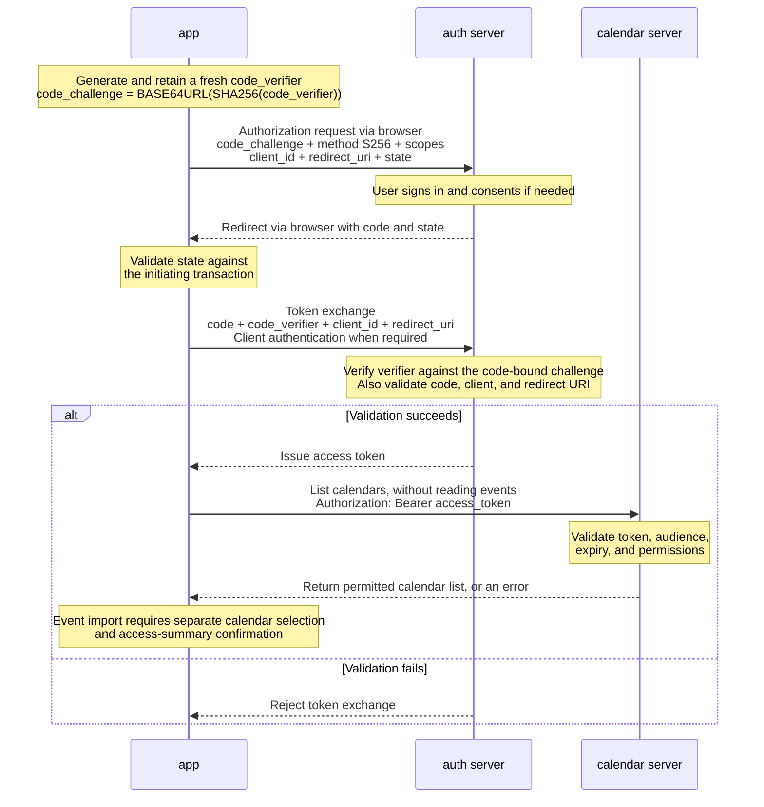

# PKCE sequence diagram

This diagram explains the OAuth 2.0 authorization code flow with PKCE. It does not establish implementation, validation, or approval to deploy or import events.

## Three roles

| Role | Description |
| --- | --- |
| `app` | The OAuth client that starts authorization, retains the verifier, exchanges the code, and calls the API. |
| `auth server` | The authorization server that handles sign-in and consent, verifies PKCE, and issues tokens. |
| `calendar server` | The resource server that validates access tokens and permissions and serves calendar data. |

User and browser actions are folded into the authorization steps to keep three roles. `app` is a logical role, not necessarily browser code; a server-side architecture retains the verifier and exchanges the code in the backend.

## Sequence diagram

## Security and scope

- PKCE means **Proof Key for Code Exchange**. With `S256`, Base64URL encoding omits trailing padding. Use a fresh, high-entropy `code_verifier` for each authorization.
- A stolen code without its matching verifier cannot pass PKCE validation. PKCE does not provide this protection if both are compromised.
- PKCE operates between `app` and `auth server`. The `calendar server` receives an access token, not the verifier; an ID token must not be used to call the calendar API.
- PKCE does not replace HTTPS, redirect URI validation, required client authentication, or application authorization. When using OIDC, also validate the ID token and applicable `nonce`. Never log codes, verifiers, or tokens.
- Provider consent does not authorize event import or sharing. Before import, confirm selected calendars, represented people, disclosure, audience, date range, and guardian authority where applicable; apply privacy filtering before data reaches an assistant or another family member.

## References

- [RFC 7636: Proof Key for Code Exchange](https://www.rfc-editor.org/rfc/rfc7636)
- [Microsoft identity platform: authorization code flow](https://learn.microsoft.com/en-us/entra/identity-platform/v2-oauth2-auth-code-flow)
- [FamilyCopilot product and privacy plan](parent-schedule-activity-discovery.md)